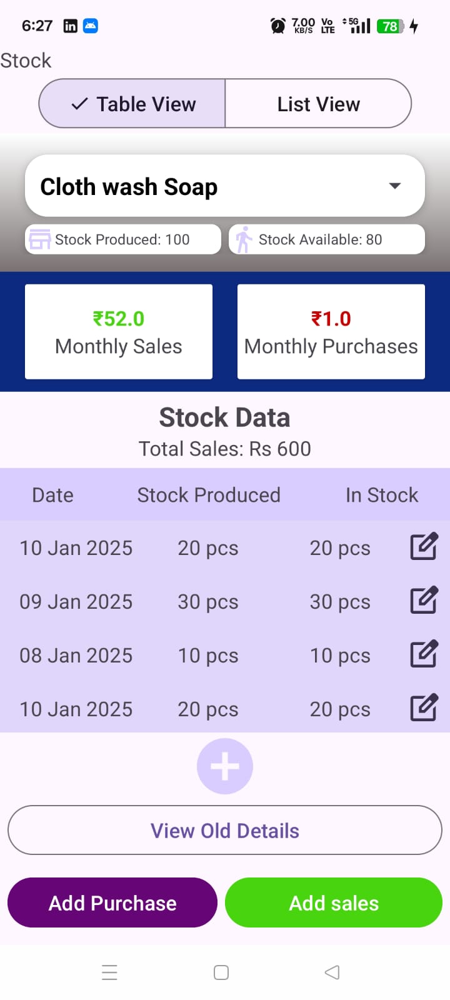
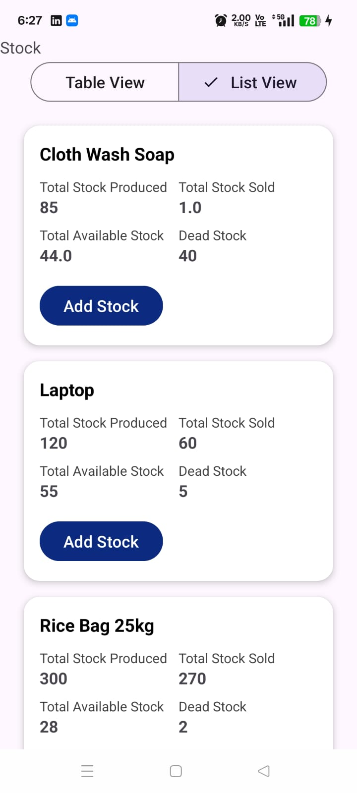

# 📦 Stock Management App UI (Android)

This is a sample Android UI for a **Stock Management** app, built using `ConstraintLayout`, `MaterialButtonToggleGroup`, and `RecyclerView`.

Users can **toggle between Table View and List View** to view their stock information.

---

## ✨ Features

- 📊 Switch between Table and List views using Material Toggle Buttons
- 📦 Table View shows production/sales/available stock metrics with cards
- 📋 List View displays product-wise summary using RecyclerView
- 🎨 Uses modern UI practices with Material Design components
- 🔄 Dynamic toggle with visibility switching between views

---

## 📸 Screenshots

| Table View | List View |
|------------|-----------|
|  |  |


---

## 🛠️ How to Run

1. Clone the repository:
   ```bash
   git clone https://github.com/Manash396/UIandroidAssgn1.git
